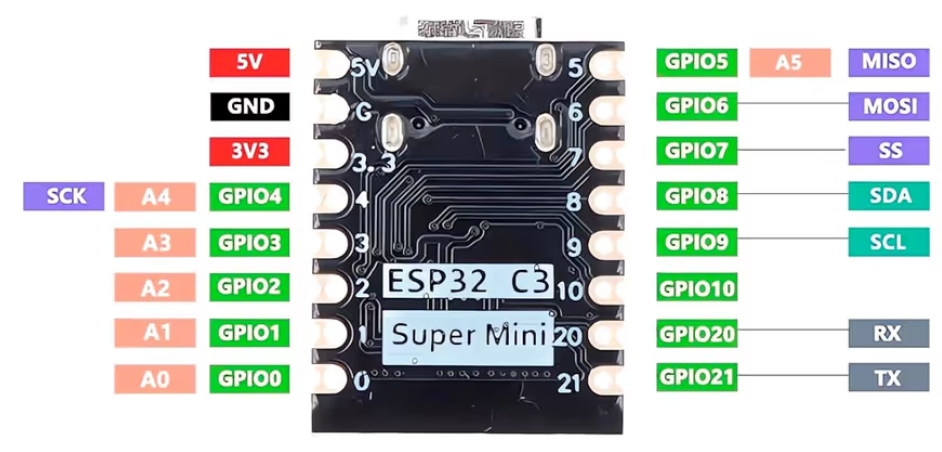

# Air Sensor

This small project allows to use an ESP32 to show temperature, humidity, and air pressure data on a display and a web server.

## Prerequisites

### Hardware

The following hardware is being used in this project:

- ESP32 C3 Super Mini ([Drivers](https://www.silabs.com/developer-tools/usb-to-uart-bridge-vcp-drivers?tab=downloads))
  
- BME280 Sensor
- SH1106 I2C Display

### Libraries

This project requires the following libraries:

- BME280 by Adafruit
- U8g2 by Oliver

> [!IMPORTANT]
> Besides the libraries, additional configuration steps are required in order to upload the program to the ESP32. The [`platformio.ini`](platformio.ini) file automatically sets everything up if the project is opened in [**PlatformIO for Visual Studio Code**](https://platformio.org/install/ide?install=vscode).

## Programming

To upload the program to the ESP32, click on _Upload_ in the IDE.

> [!TIP]
> If the upload fails, try pressing the _RST_ button while holding the _BOOT_ button on the ESP32.
